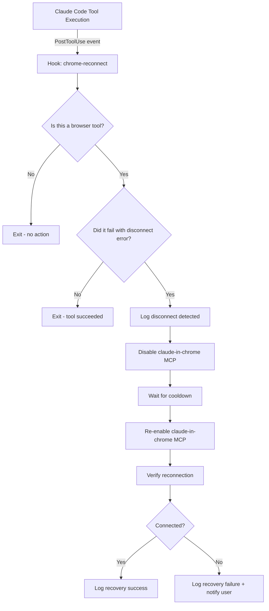

# Chrome MCP Auto-Reconnect Hook — Implementation Specification

> A Claude Code PostToolUse hook that detects Claude in Chrome MCP disconnections and automatically re-establishes the connection without manual intervention.

## Overview

The official Claude in Chrome extension suffers from chronic connection drops during browser automation sessions. Chrome's Manifest V3 architecture kills idle Service Workers after ~30 seconds, and the WebSocket bridge between Claude Code and the extension dies silently with no auto-reconnect logic. Users currently must manually disable and re-enable the MCP to restore the connection.

This hook automates that recovery. It monitors every browser tool invocation for disconnect signatures, and when detected, programmatically toggles the Claude in Chrome MCP to force a reconnection — all without interrupting the Claude Code session.

The target user is a Claude Code power user running browser automation workflows who needs resilient, hands-off Chrome MCP connectivity.

## Architecture



### Components

#### 1. PostToolUse Hook (`chrome-reconnect`)

- **Responsibility**: Intercepts tool results after execution, identifies browser tool failures caused by extension disconnection, and triggers the reconnection flow.
- **Trigger**: Fires on every `PostToolUse` event.
- **Input**: Tool name, tool result (stdout/stderr), exit code.
- **Output**: Side-effect — MCP toggle commands executed via CLI.

#### 2. Reconnection Script (`chrome-mcp-reconnect.sh`)

- **Responsibility**: Performs the actual disable/re-enable cycle of the Claude in Chrome MCP server.
- **Input**: Called by the hook when a disconnect is detected.
- **Output**: Exit code indicating success/failure of reconnection.
- **Key behaviour**:
  - Debounce: Skip if a reconnect was attempted within the last 30 seconds (avoid rapid-fire toggling).
  - Cooldown: Wait a configurable delay between disable and re-enable (default 3 seconds).
  - Retry: Attempt reconnection up to 3 times before giving up.
  - Logging: Append all actions to a log file for debugging.

## Tech Stack

| Layer | Choice | Notes |
|-------|--------|-------|
| Hook runtime | Bash | Claude Code hooks execute as shell commands |
| Hook config | `~/.claude/settings.json` or `~/.claude/hooks/` | Standard Claude Code hook configuration |
| MCP control | `claude mcp disable` / `claude mcp enable` | [TBD] Verify exact CLI commands for toggling MCP servers |
| State tracking | File-based (`/tmp/chrome-mcp-reconnect.state`) | Stores last reconnect timestamp for debouncing |
| Logging | File-based (`~/.claude/logs/chrome-reconnect.log`) | Append-only log with timestamps |

## Hook Configuration

The hook should be registered in Claude Code's hook system as a `PostToolUse` hook.

```json
{
  "hooks": {
    "PostToolUse": [
      {
        "matcher": "mcp__claude-in-chrome__*",
        "command": "~/.claude/hooks/chrome-mcp-reconnect.sh \"$TOOL_NAME\" \"$TOOL_OUTPUT\" \"$EXIT_CODE\""
      }
    ]
  }
}
```

**Note**: The exact hook event schema and available environment variables need to be verified against the current Claude Code hooks documentation. Key questions:

- What environment variables or stdin data does `PostToolUse` receive?
- Does the matcher support glob patterns on tool names?
- Can the hook access the tool's stderr/stdout output?

## Detection Logic

### Disconnect Signatures

The hook should match against known error strings that indicate a Chrome extension disconnect:

1. `"Browser extension is not connected"`
2. `"Please ensure the Claude browser extension is installed and running"`
3. `"No Chrome extension connected"`
4. `"not connected"` (in context of browser tool failure)

### Tool Name Patterns

Only trigger on Claude in Chrome MCP tools. Known tool name patterns:

- `mcp__claude-in-chrome__tabs_context_mcp`
- `mcp__claude-in-chrome__switch_browser`
- `mcp__claude-in-chrome__navigate`
- `mcp__claude-in-chrome__screenshot`
- `mcp__claude-in-chrome__click`
- `mcp__claude-in-chrome__javascript_exec`
- Any tool matching `mcp__claude-in-chrome__*`

## Reconnection Strategy

### Step-by-step Flow

1. **Detect**: Hook sees a browser tool failure matching disconnect signatures.
2. **Debounce check**: Read `/tmp/chrome-mcp-reconnect.state` — if last attempt was < 30s ago, skip.
3. **Log**: Write timestamp and tool name to log file.
4. **Disable MCP**: Run the CLI command to disable the `claude-in-chrome` MCP server.
5. **Cooldown**: Sleep for 3 seconds.
6. **Re-enable MCP**: Run the CLI command to re-enable the `claude-in-chrome` MCP server.
7. **Verify**: [TBD] Ping the MCP to confirm it's responsive.
8. **Update state**: Write current timestamp to state file.
9. **Retry**: If verification fails, repeat steps 4-8 up to 3 times with exponential backoff (3s, 6s, 12s).
10. **Report**: If all retries fail, log failure and optionally notify via stderr.

### Alternative: `/chrome reconnect` Command

Claude Code may have a built-in `/chrome reconnect` command. If available, the hook could invoke this instead of manually toggling the MCP. This needs investigation.

## Non-Functional Requirements

- **Latency**: The reconnect cycle should complete in under 15 seconds for the happy path.
- **Reliability**: Must not crash the Claude Code session. All errors caught and logged.
- **Idempotency**: Running the reconnect multiple times in quick succession should be safe (debounce handles this).
- **Observability**: All reconnect attempts logged with timestamps, tool name, attempt number, and outcome.
- **Portability**: Must work on Linux (Ubuntu — the Azure VM environment) and ideally macOS.

## Implementation Phases

### Phase 1: Basic Hook with Manual Toggle

- Deliverables:
  - `chrome-mcp-reconnect.sh` script with disconnect detection and MCP toggle logic
  - Hook registration in Claude Code settings
  - File-based debounce to prevent rapid toggling
  - Basic logging to `~/.claude/logs/chrome-reconnect.log`
- Dependencies:
  - Confirm exact Claude Code CLI commands for MCP disable/enable
  - Confirm PostToolUse hook event schema and available data

### Phase 2: Verification and Retry Logic

- Deliverables:
  - Post-reconnect verification (ping the MCP to confirm it's alive)
  - Retry with exponential backoff
  - Structured log output (JSON lines) for easier debugging
- Dependencies:
  - A reliable way to health-check the MCP connection from a script

### Phase 3: Proactive Keepalive (Optional)

- Deliverables:
  - A separate background process (or PreToolUse hook) that sends periodic pings to keep the Chrome extension alive
  - Prevent disconnects rather than just recovering from them
- Dependencies:
  - Understanding of the Chrome extension's keepalive requirements
  - May require modifying the native host or extension itself

## Open Questions

- [ ] What are the exact CLI commands to disable/re-enable a specific MCP server in Claude Code? (`claude mcp disable claude-in-chrome`? or via `/mcp` command?)
- [ ] What data does the `PostToolUse` hook event provide? (env vars, stdin JSON, tool output access?)
- [ ] Does the `matcher` field in hook config support glob patterns like `mcp__claude-in-chrome__*`?
- [ ] Is `/chrome reconnect` a viable alternative to full MCP toggle?
- [ ] Can `CLAUDE_CODE_REMOTE_SEND_KEEPALIVES=1` be combined with this hook for better results?
- [ ] Does toggling the MCP from within a hook cause any re-entrancy issues in Claude Code?
- [ ] What's the exact file path for Claude Code hook configuration on the current version? (`settings.json` vs `settings.local.json` vs `.claude/hooks/`)
